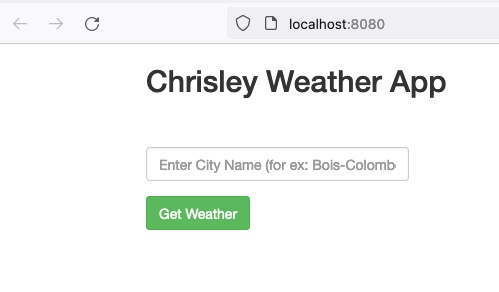

# weather-app

This application gives the live weather based on data from [https://openweathermap.org/](https://openweathermap.org/)

## Build image manually

	> docker build -t <name>:<tag> .

_Example:_

	> docker build -t weather:0.1 .

## Test image

	> docker run -ti -p <localport>:80 <name>:<tag>

_Example:_ map localport 80

	> docker run -ti -p 80:80 weather-alpine:0.1
	
	weather@0.0.0 start
	node ./bin/www

Go to [http://localhost:80](http://localhost:80)

## Push image on DockerHub/Quay.io

	> docker push <image>:<tag>

## Openshift / Kubernetes deployment

Go to [k8s](k8s)

	tree .
	.
	├── deployment.yaml
	├── kustomization.yaml
	├── route.yaml
	└── service.yaml

Edit [deployment.yaml](k8s/deployment.yaml) to change image:tag variable to your image:tag

      containers:
      - name: nodejs-weather-app
        image: image:tag
        
Example: change image:tag to weather:0.1

	> sed -i -e 's/image:tag/weather:0.1/g' deployment.yaml

-

      containers:
      - name: nodejs-weather-app
        image: weather:0.1
        
Apply the configuration

	> kubectl -f .
	
	
